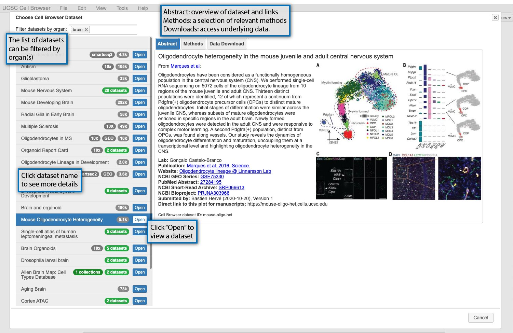
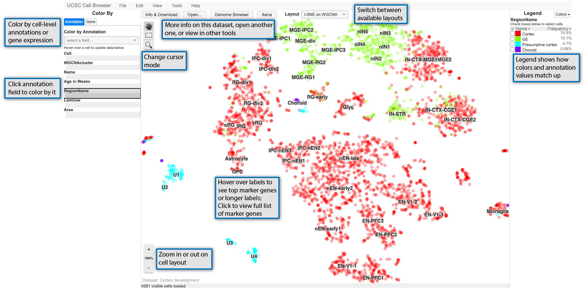
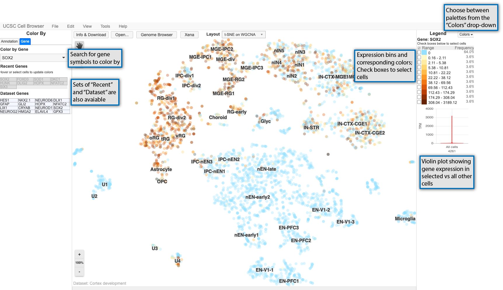
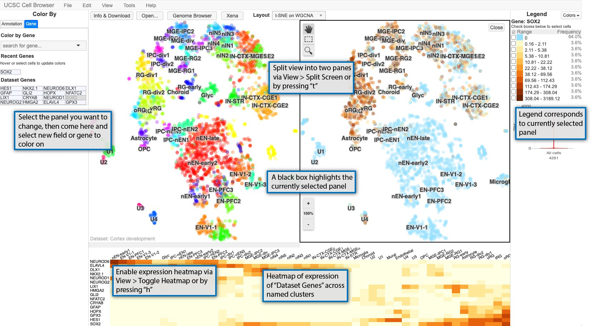
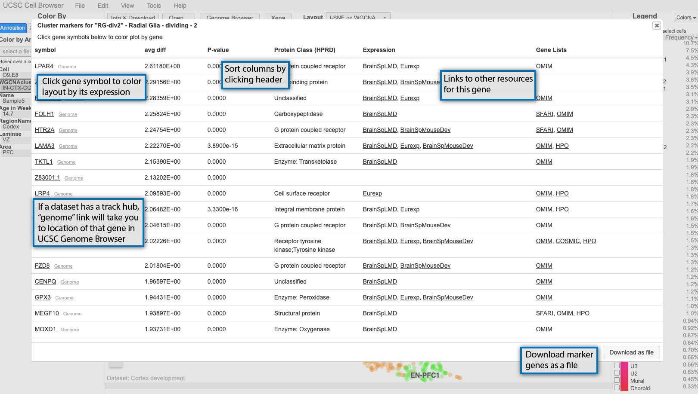

Cell Browser Interface
=====

.. contents:: 

Selecting a dataset and learning about it 
----

When you first open https://cells.ucsc.edu or your local cell browser, you will be greeted by a dataset select screen. This image highlights some of these features, or read more about them below the image. 

The datasets available are listed on the lefthand side of the screen. Datasets can be filtered using organ labels (e.g. skin, kidney) if available. If you select a dataset, information about it will be shown on the right. There are three informational tabs:

* The "Abstract" tab contains a short description of the dataset, typically the abstract of an associated paper, and links to the paper, GEO, or other related resources. 
* The "Methods" tab contains a short description of the methods used to generate the dataset.
* The "Data Download" tab contains links to download the data underlying the dataset in the cell browser, such as expression matrix and metadata. 

To open the cell browser for that dataset, double-click it in the dataset list or click "Open".
  
Basic Cell Browser features
----

After you have opened a dataset, you will be taken to the main way of visualizing datasets in the Cell Browser, an annotated scatterplot derived from UMAP, tSNE, or some other dimensionality reduction method. The image below highlights some of the main features of this core visualization: 

  
The main scatterplot will be colored by default using a field from the "Annotation" tab on the lefthand side of the screen and can be changed by clicking on a new field. The values in the selected field are shown in the "Legend" on the righthand side of the screen. You can zoom in or out on this plot using the buttons in the lower left of the screen or your center mouse wheel with the "100%" button or space bar returning you to the default zoom. Depending on the cursor mode, you can: 
* pan around the view (the hand)
* select cells (dashed outline rectangle)
* select and then zoom in on the plot (magnifying glass)

For many datasets, the plot in the center of the screen will include cluster labels. These labels can be hovered over with your mouse cursor to see more details if they are present, such as top marker genes or an expansion of acronym used in the label. Clicking on the clusters labels, will show you the marker genes pop-up described in the next section.

Finally, along the top, there are links to open the dataset description or switch the layout among other things. Some options are only available if certain conditions are met, such as viewing related data in Xena or the UCSC Genome Browser (if available) or navigating between datasets in a collection. 
  
Color the display by gene expression
----

In addition to being able to color by metadata as described in the previous section, you can color the scatterplot by gene expression. Start by selecting the "Gene" tab on the lefthand side and searching for a gene symbol in the search box.

Expression values are divided up into bins and associated with gradient of colors going from light to dark as shown in the legend on the right. 

Cells can be selected using the checkboxes in the legend or using the square select cursor mode. After cells are selected, a violin plot shows the expression for the currently colored gene in the selected cells versus all other cells. 

Cells can also be selected and set as the "background cells" to compare against. First, select cells as described previously, and then go to Tools > Set as background cells or type bs on your keyboard. Those cells will then set as your background and gene expression in any new selection of cells will be compared against these background cells in the violin plot. To reset the background cells, go to Tools > Reset background cells or type br. 

View expression heatmap or split the display
----

The Cell Browser also provides other methods for exploring datasets: split-screen mode and expression heatmap for the dataset genes. 

The main Cell Browser view can also be split into two panes for easy comparison of two different metadata fields or gene expression patterns or a combination of the two. Enable split-screen using View > Split screen or typing t. The currently selected panel is boxed in black with the legend reflecting the current panel. If you want to change the coloring for a panel, select it by clicking it, and then changing the coloring to whatever annotation or gene you want. 

Additionally, a heat map of the expression of the "dataset genes" across the cluster names displayed in the scatterplot. The size of the heatmap can be adjusted by clicking on the bar between the heat map and scatterplot and dragging it to the desired size. 

.. _marker-genes-section:
View cluster marker genes
----

If available, clicking on the cluster labels in the main scatterplot view will bring up a list of marker genes for that cluster. 

  
By default, the genes are sorted by p-value, but can be sorted by any of the other columns as well. At minimum, the pop-up will include the gene symbol and a score, but can be augmented with other scores or even links out to other resources like OMIM. If you click on the gene symbol in the first column, it will color the scatterplot by the expression of that gene. If a dataset includes a UCSC Genome Browser hub, small "genome" links will appear next to the gene symbols and clicking those will take you a genome browser view centered on that gene with the hub tracks displayed.   
  
.. Image 6:
  - find cells pop-up
